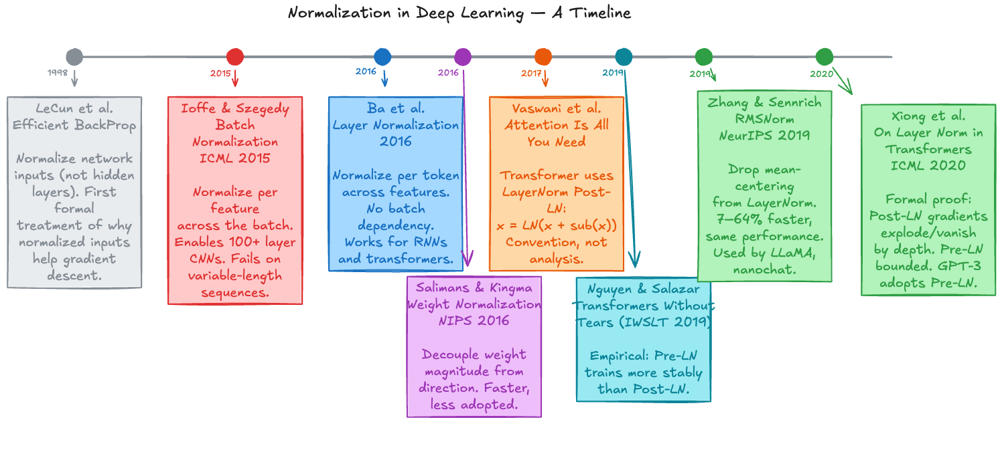
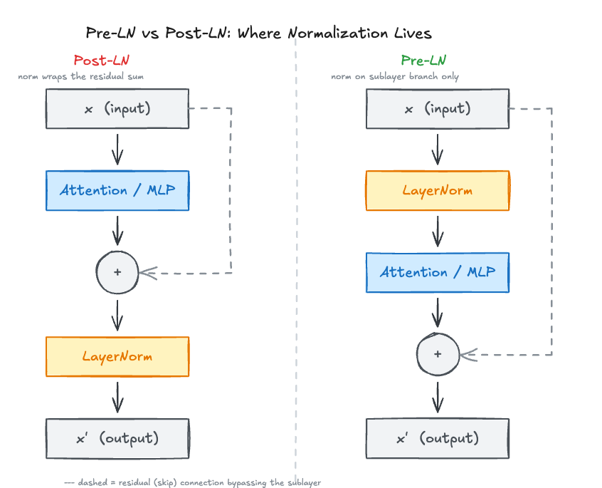

*Post 1 of the nanochat architecture series. Each post tracks a structural decision in nanochat's commit history and runs the experiment to show why it matters.*

## Why normalization exists (and how we got here)

In deep networks, optimization becomes brittle when activation and gradient scales drift across layers. Some layers saturate, others barely update, and training becomes highly sensitive to initialization and learning rate. Normalization methods aim to keep these scales in a range where gradient descent remains stable.

Historically, the field moved in stages:

- **Input normalization**: LeCun et al. [1] showed that normalized inputs improve conditioning and convergence in gradient-based training.
- **BatchNorm (2015)**: Ioffe & Szegedy [2] normalized internal activations with batch statistics, which enabled deeper and faster CNN training.
- **WeightNorm (2016)**: Salimans & Kingma [10] showed that similar optimization gains can come from weight reparameterization (`w = g * v / ||v||`) rather than activation normalization.
- **LayerNorm (2016)**: Ba et al. [3] removed batch dependence by normalizing across features per token/example, making normalization practical for variable-length sequence models.

For transformers, this timeline changes the design question. By 2017, the issue was no longer *whether* to normalize, but *where* to place normalization inside a residual block.



Vaswani et al. [4] used Post-LN in the original transformer. Later work showed that Pre-LN is more stable to train [5, 7], and modern LLMs often pair Pre-LN placement with RMSNorm [6]. This post tests that decision boundary directly.

### Techniques explored in this post's results

Beyond the historical Pre-LN vs Post-LN comparison, this experiment tracks six normalization-placement techniques under identical training conditions:

- **Pre-LN**: normalize before each sublayer; modern default [5, 7].
- **Post-LN**: normalize after residual addition; original transformer placement [4].
- **Mix-LN**: hybrid placement (early Post-LN, later Pre-LN) to balance stability and layer utilization [9].
- **NormFormer-style extra norms**: Pre-LN backbone with additional within-sublayer norms to reduce gradient magnitude mismatch [11].
- **Sub-LN (Magneto-style sublayer normalization)**: Pre-LN backbone with an alternative within-MLP norm placement [12].
- **Peri-LN**: pre- and post-sublayer normalization to stabilize variance and gradients [13].

This setup gives a direct view of both questions: why Pre-LN replaced Post-LN, and what newer methods change relative to standard Pre-LN.
With that context in place, we can isolate the architectural fork in code.

## The normalization placement decision

Here is nanochat's transformer block. The comparison is purely about normalization placement:

```python
# Post-LN: normalize after the residual addition [4]
x = norm(x + self.attn(x, cos_sin, kv_cache))
x = norm(x + self.mlp(x))

# Pre-LN: normalize before the sublayer (every modern model)
x = x + self.attn(norm(x), cos_sin, kv_cache)
x = x + self.mlp(norm(x))
```



This is the full structural delta: in Post-LN, `norm` wraps the residual sum; in Pre-LN, `norm` is applied before each sublayer call.

The original transformer [4] used Post-LN. Major later models, including GPT-3-era and newer systems [8], standardized on Pre-LN. The rest of this post isolates that design choice in a 135M-parameter run, quantifies the training and quality effects, and documents a warmdown failure mode that is underreported in standard summaries.
First, we sketch the mechanism that predicts the observed behavior.

## Why Post-LN fails: the gradient analysis

Xiong et al. [7, Theorem 1] show that, at initialization in Post-LN transformers, the gradient norm for layer $i$ scales exponentially with depth distance from the output. Output-adjacent layers receive large gradients, while input-adjacent layers receive much smaller gradients.

In Post-LN, normalization wraps the residual sum:

```
gradient flows back from loss
  → through norm at layer L
  → through residual addition
  → through norm at layer L-1
  → through residual addition
  → ...
  → through norm at layer 1
  → to the input
```

Each backward pass through normalization contributes a multiplicative term. Across $L$ layers, those terms compound: amplification near the output and attenuation toward the input. The resulting gradient imbalance explains why upper layers dominate updates while early layers learn slowly.

In Pre-LN, the norm is on the sublayer branch, not on the residual path:

```
gradient flows back from loss
  → through the direct residual path (no norms)
  → to the input
```

The residual stream provides a direct gradient path across depth without repeated normalization on that path. This keeps gradient magnitudes more uniform and avoids the exponential imbalance seen in Post-LN.
We then test that prediction under controlled training conditions.

## The experiment

To test this in training, we use nanochat's initial commit architecture (October 13, 2025, commit `3a5e0bc5`) and run two variants:

- **Pre-LN**: `norm_placement="pre"` (original nanochat architecture)
- **Post-LN**: `norm_placement="post"` (two-line change in `Block.forward`)

All other settings are held constant: architecture, data, random seed, and hyperparameters.

**Architecture**: 12 layers, 768 embedding dim, 6 attention heads, RMSNorm (no learnable parameters), RoPE, QK-Norm, ReLU^2 activation, untied embeddings, and logit softcap. Total parameters: 135.3M.

**Training**: FinewebEdu-100B, 5,160 steps, ~2.7B tokens, batch size 524,288 tokens. Muon optimizer for transformer matrices and AdamW for embeddings and `lm_head`. Gradient clipping at 1.0. No warmup (`warmup_ratio=0.0`). LR warmdown starts at step 4128 (final 20% of training). Hardware: one RTX 5090. Runtime: ~4.3 hours per run.

**Metric**: Validation BPB (bits per byte) on a fixed FinewebEdu validation split, evaluated every 250 steps. We compute `BPB = Σ(nats) / (ln(2) × Σ(bytes))`, so tokens that represent more bytes contribute proportionally more. This makes comparison independent of tokenizer vocabulary size. Lower is better.
The results below are ordered from mechanism checks to end-of-training outcomes.

## Results

### Gradient imbalance: theory confirmed


At step 50, the earliest step with meaningful gradients under nanochat's zero-initialized output projections, the layerwise skew is already large. For the MLP output projection (`mlp.c_proj`), Post-LN layer 11 has a gradient L2 norm 79x larger than layer 0. Pre-LN's ratio across the same layers is 1.6x.

The attention output projection (`attn.c_proj`) matches this pattern: Post-LN layer 11 is 33x larger than layer 0, while Pre-LN is 2.5x.

These measurements are consistent with Xiong et al.'s Theorem 1 [7]. In Post-LN, early layers receive much weaker gradient signal than late layers.

### Quality gap: consistent and widening


The quality gap appears at the first validation point. At step 250, Pre-LN leads by 0.11 BPB.

Through the middle of training (steps 1000--4000), the gap stays in the 0.21--0.23 BPB range as Post-LN improves but does not close the difference.

Post-LN's best value is 1.8885 BPB at step 3750. Pre-LN reaches 1.8885 before step 500 and continues improving.

### Warmdown failure mode

The divergence is largest at step 4128, when LR warmdown begins.

For Pre-LN, warmdown behaves as intended: BPB improves from 1.7031 to 1.6372 over the final 1,032 steps (−0.066 BPB).

For Post-LN, warmdown coincides with failure. Within two warmdown steps, gradient norm spikes to 15.1. BPB then rises from 1.9089 to 2.42, and the run does not recover as learning rate decays.

This sequence is not directly described in Xiong et al. [7], but it is consistent with their mechanism. Across 5,160 steps, Post-LN records 103 gradient spikes above norm 2.0, versus 10 for Pre-LN. That difference indicates substantially higher instability before warmdown.


Pre-LN stays near the chart floor. Post-LN shows repeated spikes, concentrated in the second half of training, with multiple events above norm 20 and two above 50.

### Summary

| Metric | Pre-LN | Post-LN |
|--------|--------|---------|
| Best val BPB | **1.6372** (step 5160) | 1.8885 (step 3750) |
| Final val BPB | **1.6372** | 2.4164 |
| Gradient spikes > 2.0 | 10 | 103 |
| Warmdown effect on BPB | −0.066 | +0.507 |

## What this means

In this setup, Pre-LN is the practical default. It remains stable without warmup-specific fixes, handles warmdown, and reaches better validation BPB. Xiong et al. [7] predicts the Post-LN gradient imbalance mechanism, and the measurements here match that prediction at 12 layers. The imbalance is visible by step 50, and the quality gap appears at the first validation point.

This does not make normalization placement a solved problem. Recent work also reports a Pre-LN tradeoff: the residual path carries contributions from later layers, while per-layer gradients can be diluted relative to Post-LN output-adjacent layers. Mix-LN reports associated deep-layer underutilization [9]. That is consistent with pruning results discussed in that line of work.

So the current boundary is practical rather than final. Pre-LN addresses the Post-LN instability shown here, but newer variants (Mix-LN, Peri-LN, HybridNorm) target the remaining expressivity/stability tradeoff. In nanochat, starting from Pre-LN is therefore a controlled baseline for later changes (residual lambdas, value embeddings, and initialization) that also affect gradient flow.
The final section provides the exact commands and artifacts needed to reproduce these runs.

## Reproducing this experiment

Reproducing the result requires one GPU with at least 24 GB VRAM and about 4.3 hours per run. Use `scripts/post01_train.py` for training and `blog/post01_pre_norm/visualizations.ipynb` for analysis.

```bash
# Pre-LN run
python scripts/post01_train.py --norm-placement pre --output-dir post01_data/pre_ln

# Post-LN run
python scripts/post01_train.py --norm-placement post --output-dir post01_data/post_ln
```

Each run logs per-step gradient norms, activation statistics, and validation BPB to JSONL files consumed by the notebook.

## References

- [1] LeCun, Y., Bottou, L., Orr, G. B., & Muller, K.-R. (1998). Efficient BackProp. In *Neural Networks: Tricks of the Trade*. [Springer chapter](https://link.springer.com/chapter/10.1007/3-540-49430-8_2)
- [2] Ioffe, S., & Szegedy, C. (2015). Batch Normalization: Accelerating Deep Network Training by Reducing Internal Covariate Shift. [arXiv:1502.03167](https://arxiv.org/abs/1502.03167)
- [3] Ba, J. L., Kiros, J. R., & Hinton, G. E. (2016). Layer Normalization. [arXiv:1607.06450](https://arxiv.org/abs/1607.06450)
- [4] Vaswani, A., et al. (2017). Attention Is All You Need. NeurIPS 2017. [arXiv:1706.03762](https://arxiv.org/abs/1706.03762)
- [5] Nguyen, T. Q., & Salazar, J. (2019). Transformers without Tears: Improving the Normalization of Self-Attention. IWSLT 2019. [arXiv:1910.05895](https://arxiv.org/abs/1910.05895)
- [6] Zhang, B., & Sennrich, R. (2019). Root Mean Square Layer Normalization. NeurIPS 2019. [arXiv:1910.07467](https://arxiv.org/abs/1910.07467)
- [7] Xiong, R., et al. (2020). On Layer Normalization in the Transformer Architecture. ICML 2020. [arXiv:2002.04745](https://arxiv.org/abs/2002.04745)
- [8] Brown, T., et al. (2020). Language Models are Few-Shot Learners (GPT-3). NeurIPS 2020. [arXiv:2005.14165](https://arxiv.org/abs/2005.14165)
- [9] Li, Y., et al. (2024). Mix-LN: Unleashing the Power of Deeper Layers by Combining Pre-LN and Post-LN. ICLR 2025. [arXiv:2412.13795](https://arxiv.org/abs/2412.13795)
- [10] Salimans, T., & Kingma, D. P. (2016). Weight Normalization: A Simple Reparameterization to Accelerate Training of Deep Neural Networks. NeurIPS 2016. [arXiv:1602.07868](https://arxiv.org/abs/1602.07868)
- [11] Shleifer, S., Ott, M., Lin, J., & Du, N. (2021). NormFormer: Improved Transformer Pretraining with Extra Normalization. [arXiv:2110.09456](https://arxiv.org/abs/2110.09456)
- [12] Wang, W., et al. (2022). Magneto: A Foundation Transformer. [arXiv:2210.06423](https://arxiv.org/abs/2210.06423)
- [13] Kim, S., et al. (2025). Peri-LN: Revisiting Layer Normalization in the Transformer Architecture. [arXiv:2502.02732](https://arxiv.org/abs/2502.02732)

*Next post: nanochat's weight initialization scheme (Jan 1, 2026 commit) and what it changes about early training dynamics.*
