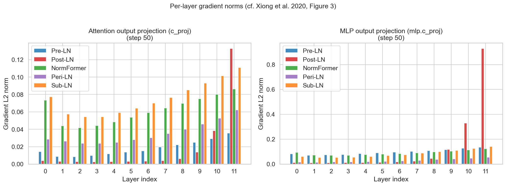
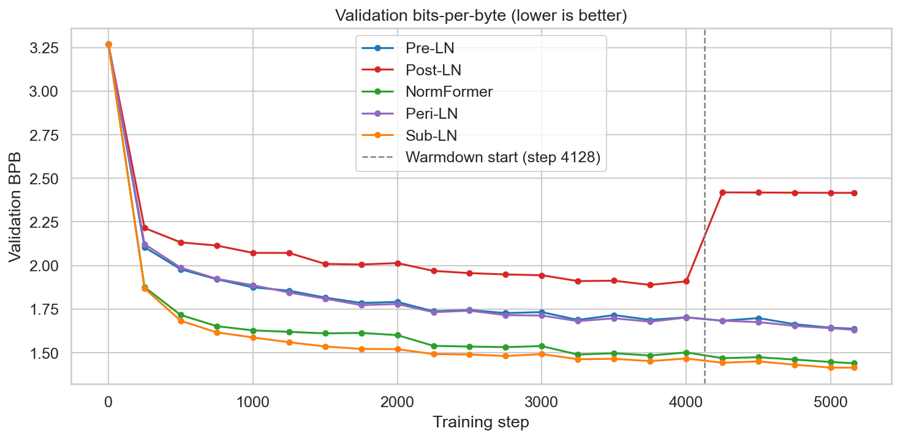
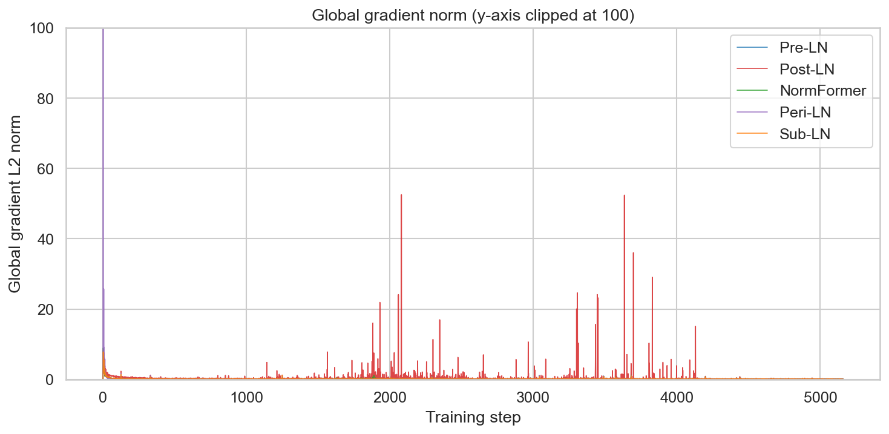

# Pre-Norm: the two-line decision behind every modern transformer

*Post 1 of the nanochat architecture series. Each post tracks a structural decision in nanochat's commit history and runs the experiment to show why it matters.*

---

## The question in code

Here is nanochat's transformer block. Two variants, one difference:

```python
# Post-LN: normalize after the residual addition (Vaswani et al. 2017)
x = norm(x + self.attn(x, cos_sin, kv_cache))
x = norm(x + self.mlp(x))

# Pre-LN: normalize before the sublayer (every modern model)
x = x + self.attn(norm(x), cos_sin, kv_cache)
x = x + self.mlp(norm(x))
```

That is the entire structural difference between Post-LN and Pre-LN. Move the norm call inside the sublayer branch instead of wrapping the residual sum. Two characters of code rearrangement.

The original transformer (Vaswani et al. 2017) used Post-LN. Every major model since GPT-3 (2020) uses Pre-LN: LLaMA, PaLM, Gemma, Mistral, and nanochat. This post explains what changed, runs the experiment on a 135M-parameter model to show the difference quantitatively, and covers one finding the textbook treatment misses.

---

## A brief history of putting norm in the wrong place

Normalization in deep networks did not begin with transformers.


LeCun et al. (1998) established that normalized inputs help gradient descent converge. Batch Normalization (Ioffe & Szegedy 2015) extended this to internal activations and transformed CNN training, enabling 100+ layer networks. It failed on sequence models: batch statistics are unreliable for variable-length inputs, and normalizing across the batch dimension leaks information between samples.

Layer Normalization (Ba et al. 2016) fixed this. Instead of normalizing across the batch, it normalizes across the feature dimension -- mean and variance computed over all features for a single token. No batch size dependency, identical behavior at train and inference time.

When Vaswani et al. built the transformer in 2017, LayerNorm had just been published the year before. They applied it in Post-LN placement: `x = LayerNorm(x + Sublayer(x))`. This was not an analyzed design choice. It was the natural way to add a normalization component to a residual block. No one had examined whether the position of the norm relative to the residual addition mattered for gradient flow.

It matters.

Nguyen & Salazar (2019) found empirically that Pre-LN trains more stably. Xiong et al. (2020) proved why. GPT-3 switched to Pre-LN the same year. RMSNorm (Zhang & Sennrich 2019), which drops mean-centering from LayerNorm and is 7-64% faster with comparable performance, became the norm of choice for Pre-LN models -- including nanochat, which uses RMSNorm with no learnable parameters.

---

## Why Post-LN fails: the gradient analysis

Xiong et al. (2020, Theorem 1) showed that in a Post-LN transformer at initialization, the gradient norm for layer $i$ depends exponentially on the distance from the output. Layers near the output receive large gradients; layers near the input receive vanishingly small ones.

The mechanism is straightforward. In Post-LN, the norm wraps the entire residual sum:

```
gradient flows back from loss
  → through norm at layer L
  → through residual addition
  → through norm at layer L-1
  → through residual addition
  → ...
  → through norm at layer 1
  → to the input
```

Each normalization layer in the backward pass introduces a multiplicative factor. Across L layers, this factor compounds. Near the output it amplifies; near the input it attenuates. The result is exponential gradient imbalance: layers 10 and 11 are doing all the learning, while layers 0 through 7 barely update.

In Pre-LN, the norm is on the sublayer branch, not on the residual path:

```
gradient flows back from loss
  → through the direct residual path (no norms)
  → to the input
```

The residual connection carries the gradient back through all layers without passing through any norm operations. Gradient norms stay bounded regardless of depth.

---

## The experiment

To measure this on real training runs, we take nanochat's initial commit architecture (October 13, 2025, commit `3a5e0bc5`) and train two models:

- **Pre-LN**: norm_placement="pre" (the original nanochat architecture)
- **Post-LN**: norm_placement="post" (two lines changed in `Block.forward`)

Everything else is identical: same architecture, same data, same random seed, same hyperparameters.

**Architecture**: 12 layers, 768 embedding dim, 6 attention heads, RMSNorm (no learnable params), RoPE, QK-Norm, ReLU² activation, untied embeddings, logit softcap. 135.3M parameters total.

**Training**: FinewebEdu-100B dataset, 5,160 steps, ~2.7B tokens. Batch size 524,288 tokens. Muon optimizer for transformer matrices, AdamW for embeddings and lm_head. Gradient clipping at 1.0. No warmup (warmup_ratio=0.0). LR warmdown from step 4128 (last 20% of training). Single RTX 5090, ~4.3 hours per run.

**Metric**: Validation BPB (bits-per-byte) on a fixed FinewebEdu validation split, computed every 250 steps. BPB normalizes for token length: `BPB = Σ(nats) / (ln(2) × Σ(bytes))`, so tokens representing more bytes count proportionally more. This makes it tokenizer-vocabulary-independent. Lower is better.

---

## Results

### Gradient imbalance: theory confirmed



At step 50 -- the earliest step with meaningful gradients given nanochat's zero-initialized output projections -- the gradient imbalance is already stark. For the MLP output projection (`mlp.c_proj`), Post-LN layer 11 has a gradient L2 norm 79x larger than layer 0. Pre-LN's ratio across the same layers is 1.6x.

The attention output projection (`attn.c_proj`) shows the same pattern: Post-LN layer 11 is 33x larger than layer 0; Pre-LN is 2.5x.

This is Xiong et al.'s Theorem 1, measured directly. The early layers of Post-LN are receiving almost no gradient signal. They are not learning.

### Quality gap: consistent and widening



The quality gap opens immediately. At step 250 (the first validation point), Pre-LN already leads by 0.11 BPB. The gap holds steady at 0.21--0.23 BPB through the middle of training (steps 1000--4000) as Post-LN improves but cannot close the distance.

Post-LN's best result is 1.8885 BPB at step 3750. Pre-LN reaches 1.8885 before step 500 and has long since moved past it.

### The warmdown catastrophe

The more striking finding comes at step 4128, when LR warmdown begins.

Warmdown is a final-phase LR decay that lets the model anneal into a lower-loss basin. For Pre-LN, it works as intended: BPB improves from 1.7031 to 1.6372 over the final 1,032 steps (−0.066 BPB).

For Post-LN, it fails catastrophically. Within the first two steps of warmdown, a gradient spike of norm 15.1 corrupts the model's weights. With the learning rate now decaying toward zero, the model has no capacity to recover. BPB jumps from 1.9089 to 2.42 and stays there for the remainder of training.

This failure mode is not directly described in Xiong et al., but it follows from their mechanism. Post-LN accumulated gradient instability throughout training -- 103 gradient spikes above norm 2.0 vs Pre-LN's 10 across the full 5,160 steps. Each spike left the model in a slightly degraded state. The damage was manageable when the LR was large enough to make corrective updates. Warmdown removed that safety valve.



Pre-LN's gradient trace is nearly invisible at the bottom of the chart. Post-LN's spikes are pervasive, clustered in the second half of training, with multiple events exceeding norm 20 and two above 50.

### Summary

| Metric | Pre-LN | Post-LN |
|--------|--------|---------|
| Best val BPB | **1.6372** (step 5160) | 1.8885 (step 3750) |
| Final val BPB | **1.6372** | 2.4164 |
| Gradient spikes > 2.0 | 10 | 103 |
| Warmdown effect on BPB | −0.066 | +0.507 |

---

## What this means

Pre-LN is the correct structural default. It trains stably without warmup workarounds, tolerates aggressive LR schedules including warmdown, and produces consistently better final quality. The theoretical prediction from Xiong et al. holds at 12 layers and is not subtle -- the gradient imbalance is measurable from step 50 and the quality gap is visible from the first validation point.

The one thing to note: Pre-LN does not have the last word on this problem. The same 2024--2025 literature that validated Pre-LN also identified that it introduces a different gradient imbalance. In Pre-LN models, the residual stream receives unfiltered gradient contributions from all later layers, but each individual layer's gradient is diluted relative to Post-LN's output layers. The deep layers of Pre-LN models tend to be underutilized -- this is documented in the Mix-LN paper (Li et al., ICLR 2025) and corroborated by how easily Pre-LN models' late layers can be pruned without quality loss.

Pre-LN solved Post-LN's instability and became the universal default. But norm placement is an active research area, not a closed problem. Mix-LN, Peri-LN, and HybridNorm are all attempting to recover Post-LN's per-layer expressivity while keeping Pre-LN's gradient stability. None has yet displaced Pre-LN as the default.

For nanochat, the initial commit uses Pre-LN. That is the right starting point. Later commits add other components -- residual lambdas, value embeddings, custom initialization -- that interact with gradient flow in different ways. Those experiments are the subject of the next posts in this series.

---

## Reproducing this experiment

The two training runs require a single GPU with at least 24GB VRAM and about 4.3 hours each. The training script and visualization notebook are in the nanochat repository under `scripts/post01_train.py` and `blog/post01_pre_norm/visualizations.ipynb`.

```bash
# Pre-LN run
python scripts/post01_train.py --norm-placement pre --output-dir post01_data/pre_ln

# Post-LN run
python scripts/post01_train.py --norm-placement post --output-dir post01_data/post_ln
```

Data from these runs, including per-step gradient norms, activation statistics, and validation BPB, is logged to JSONL files for analysis in the companion notebook.

---

## References

- Xiong et al. (2020). On Layer Normalization in the Transformer Architecture. ICML 2020. [arXiv:2002.04745](https://arxiv.org/abs/2002.04745)
- Vaswani et al. (2017). Attention Is All You Need. NeurIPS 2017. [arXiv:1706.03762](https://arxiv.org/abs/1706.03762)
- Ba et al. (2016). Layer Normalization. [arXiv:1607.06450](https://arxiv.org/abs/1607.06450)
- Zhang & Sennrich (2019). Root Mean Square Layer Normalization. NeurIPS 2019. [arXiv:1910.07467](https://arxiv.org/abs/1910.07467)
- Nguyen & Salazar (2019). Transformers without Tears. IWSLT 2019. [arXiv:1910.05895](https://arxiv.org/abs/1910.05895)
- Li et al. (2024). Mix-LN: Unleashing the Power of Deeper Layers by Combining Pre-LN and Post-LN. ICLR 2025. [arXiv:2412.13795](https://arxiv.org/abs/2412.13795)

---

*Next post: nanochat's weight initialization scheme (Jan 1, 2026 commit) and what it changes about early training dynamics.*
